Etude des indicateurs financiers
================

## Description du jeu de données

Source :
<https://data.enseignementsup-recherche.gouv.fr/explore/dataset/fr-esr-operateurs-indicateurs-financiers/information/>

  - Variables : uai…identifiant, exercice,
    Acquisitions.d.immobilisations, ANR.hors.investissements.d.avenir,
    ANR.investissements.d.avenir, Autres.ressources.propres,
    Autres.Subventions, Besoin.en.fonds.de.roulement,
    CAF…Produits.encaissables,
    Charges.décaissables…Produits.encaissables, Charges.externes,
    Charges.externes…Produits.encaissables,
    Contrats.et.prestations.de.recherche.hors.ANR,
    Dépenses.de.personnel, Dépenses.de.personnel…Produits.encaissables,
    Droits.d.inscription, Excédent.Brut.d.Exploitation..EBE.,
    Fonds.de.roulement.en.jours.de.charges.décaissables,
    Fonds.de.roulement.net.global,
    Formation.continue..diplômes.propres.et.VAE, Ressources.propres,
    Ressources.propres…Produits.encaissables, Résultat.net.comptable,
    Solde.budgétaire, Taxe.d.apprentissage, Trésorerie,
    Trésorerie.en.jours.de.charges.décaissables, Valorisation, rce,
    vague, typologie, code.du.groupe, groupe, uai.actuel, etablissement,
    code.de.la.commune, commune, code.de.l.academie, academie,
    code.de.la.region, region, Capacité.d.autofinancement,
    Charges.de.fonctionnement.décaissables,
    Produits.de.fonctionnement.encaissables,
    Résultat.net.comptable.hors.SIE, Subventions.de.la.région,
    Subventions.Union.Européenne, Type
  - Nombre d’observations : 1665
  - Exercices : 2010, 2020
  - Nombre d’établissements par groupe à la dernière année :
    <table>
    <thead>
    <tr>
    <th style="text-align:left;">
    code.du.groupe
    </th>
    <th style="text-align:left;">
    groupe
    </th>
    <th style="text-align:left;">
    Type
    </th>
    <th style="text-align:right;">
    nombre
    </th>
    </tr>
    </thead>
    <tbody>
    <tr>
    <td style="text-align:left;">
    </td>
    <td style="text-align:left;">
    </td>
    <td style="text-align:left;">
    Autres
    </td>
    <td style="text-align:right;">
    14
    </td>
    </tr>
    <tr>
    <td style="text-align:left;">
    </td>
    <td style="text-align:left;">
    communauté d’universités et établissements
    </td>
    <td style="text-align:left;">
    COMUE
    </td>
    <td style="text-align:right;">
    9
    </td>
    </tr>
    <tr>
    <td style="text-align:left;">
    GR11
    </td>
    <td style="text-align:left;">
    universités pluridisciplinaires avec santé
    </td>
    <td style="text-align:left;">
    Universités
    </td>
    <td style="text-align:right;">
    26
    </td>
    </tr>
    <tr>
    <td style="text-align:left;">
    GR12
    </td>
    <td style="text-align:left;">
    universités pluridisciplinaires sans santé
    </td>
    <td style="text-align:left;">
    Universités
    </td>
    <td style="text-align:right;">
    20
    </td>
    </tr>
    <tr>
    <td style="text-align:left;">
    GR13
    </td>
    <td style="text-align:left;">
    universités scientifiques et/ou médicales
    </td>
    <td style="text-align:left;">
    Universités
    </td>
    <td style="text-align:right;">
    3
    </td>
    </tr>
    <tr>
    <td style="text-align:left;">
    GR14
    </td>
    <td style="text-align:left;">
    universités tertiaires (droit et économie)
    </td>
    <td style="text-align:left;">
    Universités
    </td>
    <td style="text-align:right;">
    4
    </td>
    </tr>
    <tr>
    <td style="text-align:left;">
    GR15
    </td>
    <td style="text-align:left;">
    universités tertiaires (lettres et sciences humaines)
    </td>
    <td style="text-align:left;">
    Universités
    </td>
    <td style="text-align:right;">
    8
    </td>
    </tr>
    <tr>
    <td style="text-align:left;">
    GR20
    </td>
    <td style="text-align:left;">
    instituts d’études politiques
    </td>
    <td style="text-align:left;">
    Ecoles
    </td>
    <td style="text-align:right;">
    7
    </td>
    </tr>
    <tr>
    <td style="text-align:left;">
    GR30
    </td>
    <td style="text-align:left;">
    écoles normales supérieures
    </td>
    <td style="text-align:left;">
    Ecoles
    </td>
    <td style="text-align:right;">
    4
    </td>
    </tr>
    <tr>
    <td style="text-align:left;">
    GR40
    </td>
    <td style="text-align:left;">
    écoles françaises à l’étranger
    </td>
    <td style="text-align:left;">
    Ecoles
    </td>
    <td style="text-align:right;">
    5
    </td>
    </tr>
    <tr>
    <td style="text-align:left;">
    GR50
    </td>
    <td style="text-align:left;">
    école d’ingénieurs
    </td>
    <td style="text-align:left;">
    Ecoles
    </td>
    <td style="text-align:right;">
    1
    </td>
    </tr>
    <tr>
    <td style="text-align:left;">
    GR50
    </td>
    <td style="text-align:left;">
    écoles d’ingénieurs
    </td>
    <td style="text-align:left;">
    Ecoles
    </td>
    <td style="text-align:right;">
    31
    </td>
    </tr>
    <tr>
    <td style="text-align:left;">
    GR50
    </td>
    <td style="text-align:left;">
    universités pluridisciplinaires avec santé
    </td>
    <td style="text-align:left;">
    Universités
    </td>
    <td style="text-align:right;">
    1
    </td>
    </tr>
    <tr>
    <td style="text-align:left;">
    GR60
    </td>
    <td style="text-align:left;">
    autres établissements d’enseignement et de recherche
    </td>
    <td style="text-align:left;">
    Autres
    </td>
    <td style="text-align:right;">
    22
    </td>
    </tr>
    </tbody>
    </table>
  - Nombre d’établissements par type à la dernière année :
    <table>
    <thead>
    <tr>
    <th style="text-align:left;">
    Type
    </th>
    <th style="text-align:right;">
    nombre
    </th>
    </tr>
    </thead>
    <tbody>
    <tr>
    <td style="text-align:left;">
    Autres
    </td>
    <td style="text-align:right;">
    36
    </td>
    </tr>
    <tr>
    <td style="text-align:left;">
    COMUE
    </td>
    <td style="text-align:right;">
    9
    </td>
    </tr>
    <tr>
    <td style="text-align:left;">
    Ecoles
    </td>
    <td style="text-align:right;">
    48
    </td>
    </tr>
    <tr>
    <td style="text-align:left;">
    Universités
    </td>
    <td style="text-align:right;">
    62
    </td>
    </tr>
    </tbody>
    </table>

*Attention :* des changements de périmètre du jeu de données peuvent
affecter les résultats.

*Erreurs détectées :*

  - 14 types manquants ;
  - 1 école d’ingénieur sans s
  - 1 universités pluridisciplinaires avec santé mal groupée (?)

## Analyses globales des ressources

### Disponibilité des données

<table>

<thead>

<tr>

<th style="text-align:left;">

exercice

</th>

<th style="text-align:left;">

Type

</th>

<th style="text-align:right;">

etablissement

</th>

<th style="text-align:right;">

Produits.de.fonctionnement.encaissables

</th>

<th style="text-align:right;">

Ressources.propres

</th>

<th style="text-align:right;">

Droits.d.inscription

</th>

<th style="text-align:right;">

Formation.continue..diplômes.propres.et.VAE

</th>

<th style="text-align:right;">

Taxe.d.apprentissage

</th>

<th style="text-align:right;">

Valorisation

</th>

<th style="text-align:right;">

ANR.hors.investissements.d.avenir

</th>

<th style="text-align:right;">

ANR.investissements.d.avenir

</th>

<th style="text-align:right;">

Contrats.et.prestations.de.recherche.hors.ANR

</th>

<th style="text-align:right;">

Subventions.de.la.région

</th>

<th style="text-align:right;">

Subventions.Union.Européenne

</th>

<th style="text-align:right;">

Autres.ressources.propres

</th>

<th style="text-align:right;">

Autres.Subventions

</th>

<th style="text-align:right;">

Formation

</th>

<th style="text-align:right;">

Recherche

</th>

<th style="text-align:right;">

Autres

</th>

<th style="text-align:right;">

SCSP

</th>

</tr>

</thead>

<tbody>

<tr>

<td style="text-align:left;">

2010

</td>

<td style="text-align:left;">

Autres

</td>

<td style="text-align:right;">

17

</td>

<td style="text-align:right;">

16

</td>

<td style="text-align:right;">

16

</td>

<td style="text-align:right;">

10

</td>

<td style="text-align:right;">

11

</td>

<td style="text-align:right;">

10

</td>

<td style="text-align:right;">

10

</td>

<td style="text-align:right;">

16

</td>

<td style="text-align:right;">

16

</td>

<td style="text-align:right;">

13

</td>

<td style="text-align:right;">

9

</td>

<td style="text-align:right;">

7

</td>

<td style="text-align:right;">

16

</td>

<td style="text-align:right;">

14

</td>

<td style="text-align:right;">

17

</td>

<td style="text-align:right;">

17

</td>

<td style="text-align:right;">

17

</td>

<td style="text-align:right;">

16

</td>

</tr>

<tr>

<td style="text-align:left;">

2010

</td>

<td style="text-align:left;">

Ecoles

</td>

<td style="text-align:right;">

48

</td>

<td style="text-align:right;">

45

</td>

<td style="text-align:right;">

45

</td>

<td style="text-align:right;">

30

</td>

<td style="text-align:right;">

29

</td>

<td style="text-align:right;">

38

</td>

<td style="text-align:right;">

20

</td>

<td style="text-align:right;">

44

</td>

<td style="text-align:right;">

44

</td>

<td style="text-align:right;">

36

</td>

<td style="text-align:right;">

30

</td>

<td style="text-align:right;">

25

</td>

<td style="text-align:right;">

44

</td>

<td style="text-align:right;">

40

</td>

<td style="text-align:right;">

48

</td>

<td style="text-align:right;">

48

</td>

<td style="text-align:right;">

48

</td>

<td style="text-align:right;">

45

</td>

</tr>

<tr>

<td style="text-align:left;">

2010

</td>

<td style="text-align:left;">

Universités

</td>

<td style="text-align:right;">

73

</td>

<td style="text-align:right;">

63

</td>

<td style="text-align:right;">

63

</td>

<td style="text-align:right;">

54

</td>

<td style="text-align:right;">

63

</td>

<td style="text-align:right;">

59

</td>

<td style="text-align:right;">

57

</td>

<td style="text-align:right;">

63

</td>

<td style="text-align:right;">

63

</td>

<td style="text-align:right;">

63

</td>

<td style="text-align:right;">

60

</td>

<td style="text-align:right;">

56

</td>

<td style="text-align:right;">

63

</td>

<td style="text-align:right;">

62

</td>

<td style="text-align:right;">

73

</td>

<td style="text-align:right;">

73

</td>

<td style="text-align:right;">

73

</td>

<td style="text-align:right;">

63

</td>

</tr>

<tr>

<td style="text-align:left;">

2011

</td>

<td style="text-align:left;">

Autres

</td>

<td style="text-align:right;">

19

</td>

<td style="text-align:right;">

18

</td>

<td style="text-align:right;">

18

</td>

<td style="text-align:right;">

9

</td>

<td style="text-align:right;">

11

</td>

<td style="text-align:right;">

8

</td>

<td style="text-align:right;">

11

</td>

<td style="text-align:right;">

18

</td>

<td style="text-align:right;">

18

</td>

<td style="text-align:right;">

14

</td>

<td style="text-align:right;">

10

</td>

<td style="text-align:right;">

6

</td>

<td style="text-align:right;">

18

</td>

<td style="text-align:right;">

14

</td>

<td style="text-align:right;">

19

</td>

<td style="text-align:right;">

19

</td>

<td style="text-align:right;">

19

</td>

<td style="text-align:right;">

18

</td>

</tr>

<tr>

<td style="text-align:left;">

2011

</td>

<td style="text-align:left;">

Ecoles

</td>

<td style="text-align:right;">

46

</td>

<td style="text-align:right;">

41

</td>

<td style="text-align:right;">

41

</td>

<td style="text-align:right;">

31

</td>

<td style="text-align:right;">

31

</td>

<td style="text-align:right;">

34

</td>

<td style="text-align:right;">

19

</td>

<td style="text-align:right;">

41

</td>

<td style="text-align:right;">

41

</td>

<td style="text-align:right;">

33

</td>

<td style="text-align:right;">

30

</td>

<td style="text-align:right;">

24

</td>

<td style="text-align:right;">

41

</td>

<td style="text-align:right;">

38

</td>

<td style="text-align:right;">

46

</td>

<td style="text-align:right;">

46

</td>

<td style="text-align:right;">

46

</td>

<td style="text-align:right;">

41

</td>

</tr>

<tr>

<td style="text-align:left;">

2011

</td>

<td style="text-align:left;">

Universités

</td>

<td style="text-align:right;">

71

</td>

<td style="text-align:right;">

61

</td>

<td style="text-align:right;">

61

</td>

<td style="text-align:right;">

56

</td>

<td style="text-align:right;">

61

</td>

<td style="text-align:right;">

59

</td>

<td style="text-align:right;">

58

</td>

<td style="text-align:right;">

61

</td>

<td style="text-align:right;">

61

</td>

<td style="text-align:right;">

61

</td>

<td style="text-align:right;">

59

</td>

<td style="text-align:right;">

58

</td>

<td style="text-align:right;">

61

</td>

<td style="text-align:right;">

61

</td>

<td style="text-align:right;">

71

</td>

<td style="text-align:right;">

71

</td>

<td style="text-align:right;">

71

</td>

<td style="text-align:right;">

61

</td>

</tr>

<tr>

<td style="text-align:left;">

2012

</td>

<td style="text-align:left;">

Autres

</td>

<td style="text-align:right;">

16

</td>

<td style="text-align:right;">

15

</td>

<td style="text-align:right;">

15

</td>

<td style="text-align:right;">

9

</td>

<td style="text-align:right;">

11

</td>

<td style="text-align:right;">

8

</td>

<td style="text-align:right;">

9

</td>

<td style="text-align:right;">

15

</td>

<td style="text-align:right;">

15

</td>

<td style="text-align:right;">

11

</td>

<td style="text-align:right;">

9

</td>

<td style="text-align:right;">

7

</td>

<td style="text-align:right;">

15

</td>

<td style="text-align:right;">

12

</td>

<td style="text-align:right;">

16

</td>

<td style="text-align:right;">

16

</td>

<td style="text-align:right;">

16

</td>

<td style="text-align:right;">

15

</td>

</tr>

<tr>

<td style="text-align:left;">

2012

</td>

<td style="text-align:left;">

Ecoles

</td>

<td style="text-align:right;">

46

</td>

<td style="text-align:right;">

46

</td>

<td style="text-align:right;">

46

</td>

<td style="text-align:right;">

36

</td>

<td style="text-align:right;">

35

</td>

<td style="text-align:right;">

40

</td>

<td style="text-align:right;">

24

</td>

<td style="text-align:right;">

46

</td>

<td style="text-align:right;">

46

</td>

<td style="text-align:right;">

38

</td>

<td style="text-align:right;">

33

</td>

<td style="text-align:right;">

28

</td>

<td style="text-align:right;">

46

</td>

<td style="text-align:right;">

44

</td>

<td style="text-align:right;">

46

</td>

<td style="text-align:right;">

46

</td>

<td style="text-align:right;">

46

</td>

<td style="text-align:right;">

46

</td>

</tr>

<tr>

<td style="text-align:left;">

2012

</td>

<td style="text-align:left;">

Universités

</td>

<td style="text-align:right;">

76

</td>

<td style="text-align:right;">

70

</td>

<td style="text-align:right;">

70

</td>

<td style="text-align:right;">

68

</td>

<td style="text-align:right;">

70

</td>

<td style="text-align:right;">

68

</td>

<td style="text-align:right;">

62

</td>

<td style="text-align:right;">

70

</td>

<td style="text-align:right;">

70

</td>

<td style="text-align:right;">

70

</td>

<td style="text-align:right;">

69

</td>

<td style="text-align:right;">

66

</td>

<td style="text-align:right;">

70

</td>

<td style="text-align:right;">

70

</td>

<td style="text-align:right;">

76

</td>

<td style="text-align:right;">

76

</td>

<td style="text-align:right;">

76

</td>

<td style="text-align:right;">

70

</td>

</tr>

<tr>

<td style="text-align:left;">

2013

</td>

<td style="text-align:left;">

Autres

</td>

<td style="text-align:right;">

15

</td>

<td style="text-align:right;">

15

</td>

<td style="text-align:right;">

15

</td>

<td style="text-align:right;">

10

</td>

<td style="text-align:right;">

10

</td>

<td style="text-align:right;">

9

</td>

<td style="text-align:right;">

10

</td>

<td style="text-align:right;">

15

</td>

<td style="text-align:right;">

15

</td>

<td style="text-align:right;">

14

</td>

<td style="text-align:right;">

10

</td>

<td style="text-align:right;">

8

</td>

<td style="text-align:right;">

15

</td>

<td style="text-align:right;">

13

</td>

<td style="text-align:right;">

15

</td>

<td style="text-align:right;">

15

</td>

<td style="text-align:right;">

15

</td>

<td style="text-align:right;">

15

</td>

</tr>

<tr>

<td style="text-align:left;">

2013

</td>

<td style="text-align:left;">

Ecoles

</td>

<td style="text-align:right;">

47

</td>

<td style="text-align:right;">

42

</td>

<td style="text-align:right;">

42

</td>

<td style="text-align:right;">

34

</td>

<td style="text-align:right;">

34

</td>

<td style="text-align:right;">

37

</td>

<td style="text-align:right;">

19

</td>

<td style="text-align:right;">

42

</td>

<td style="text-align:right;">

42

</td>

<td style="text-align:right;">

34

</td>

<td style="text-align:right;">

33

</td>

<td style="text-align:right;">

28

</td>

<td style="text-align:right;">

42

</td>

<td style="text-align:right;">

41

</td>

<td style="text-align:right;">

47

</td>

<td style="text-align:right;">

47

</td>

<td style="text-align:right;">

47

</td>

<td style="text-align:right;">

42

</td>

</tr>

<tr>

<td style="text-align:left;">

2013

</td>

<td style="text-align:left;">

Universités

</td>

<td style="text-align:right;">

77

</td>

<td style="text-align:right;">

65

</td>

<td style="text-align:right;">

65

</td>

<td style="text-align:right;">

63

</td>

<td style="text-align:right;">

65

</td>

<td style="text-align:right;">

64

</td>

<td style="text-align:right;">

58

</td>

<td style="text-align:right;">

65

</td>

<td style="text-align:right;">

65

</td>

<td style="text-align:right;">

65

</td>

<td style="text-align:right;">

65

</td>

<td style="text-align:right;">

64

</td>

<td style="text-align:right;">

65

</td>

<td style="text-align:right;">

65

</td>

<td style="text-align:right;">

77

</td>

<td style="text-align:right;">

77

</td>

<td style="text-align:right;">

77

</td>

<td style="text-align:right;">

65

</td>

</tr>

<tr>

<td style="text-align:left;">

2014

</td>

<td style="text-align:left;">

Autres

</td>

<td style="text-align:right;">

26

</td>

<td style="text-align:right;">

26

</td>

<td style="text-align:right;">

22

</td>

<td style="text-align:right;">

8

</td>

<td style="text-align:right;">

10

</td>

<td style="text-align:right;">

9

</td>

<td style="text-align:right;">

11

</td>

<td style="text-align:right;">

22

</td>

<td style="text-align:right;">

22

</td>

<td style="text-align:right;">

17

</td>

<td style="text-align:right;">

10

</td>

<td style="text-align:right;">

7

</td>

<td style="text-align:right;">

22

</td>

<td style="text-align:right;">

18

</td>

<td style="text-align:right;">

26

</td>

<td style="text-align:right;">

26

</td>

<td style="text-align:right;">

26

</td>

<td style="text-align:right;">

22

</td>

</tr>

<tr>

<td style="text-align:left;">

2014

</td>

<td style="text-align:left;">

Ecoles

</td>

<td style="text-align:right;">

51

</td>

<td style="text-align:right;">

51

</td>

<td style="text-align:right;">

42

</td>

<td style="text-align:right;">

33

</td>

<td style="text-align:right;">

34

</td>

<td style="text-align:right;">

36

</td>

<td style="text-align:right;">

19

</td>

<td style="text-align:right;">

42

</td>

<td style="text-align:right;">

42

</td>

<td style="text-align:right;">

34

</td>

<td style="text-align:right;">

31

</td>

<td style="text-align:right;">

28

</td>

<td style="text-align:right;">

42

</td>

<td style="text-align:right;">

40

</td>

<td style="text-align:right;">

51

</td>

<td style="text-align:right;">

51

</td>

<td style="text-align:right;">

51

</td>

<td style="text-align:right;">

42

</td>

</tr>

<tr>

<td style="text-align:left;">

2014

</td>

<td style="text-align:left;">

Universités

</td>

<td style="text-align:right;">

76

</td>

<td style="text-align:right;">

75

</td>

<td style="text-align:right;">

65

</td>

<td style="text-align:right;">

62

</td>

<td style="text-align:right;">

64

</td>

<td style="text-align:right;">

62

</td>

<td style="text-align:right;">

57

</td>

<td style="text-align:right;">

65

</td>

<td style="text-align:right;">

65

</td>

<td style="text-align:right;">

65

</td>

<td style="text-align:right;">

65

</td>

<td style="text-align:right;">

63

</td>

<td style="text-align:right;">

65

</td>

<td style="text-align:right;">

65

</td>

<td style="text-align:right;">

76

</td>

<td style="text-align:right;">

76

</td>

<td style="text-align:right;">

76

</td>

<td style="text-align:right;">

64

</td>

</tr>

<tr>

<td style="text-align:left;">

2015

</td>

<td style="text-align:left;">

Autres

</td>

<td style="text-align:right;">

24

</td>

<td style="text-align:right;">

22

</td>

<td style="text-align:right;">

17

</td>

<td style="text-align:right;">

8

</td>

<td style="text-align:right;">

10

</td>

<td style="text-align:right;">

7

</td>

<td style="text-align:right;">

11

</td>

<td style="text-align:right;">

17

</td>

<td style="text-align:right;">

17

</td>

<td style="text-align:right;">

13

</td>

<td style="text-align:right;">

8

</td>

<td style="text-align:right;">

8

</td>

<td style="text-align:right;">

17

</td>

<td style="text-align:right;">

15

</td>

<td style="text-align:right;">

24

</td>

<td style="text-align:right;">

24

</td>

<td style="text-align:right;">

24

</td>

<td style="text-align:right;">

15

</td>

</tr>

<tr>

<td style="text-align:left;">

2015

</td>

<td style="text-align:left;">

Ecoles

</td>

<td style="text-align:right;">

51

</td>

<td style="text-align:right;">

51

</td>

<td style="text-align:right;">

38

</td>

<td style="text-align:right;">

31

</td>

<td style="text-align:right;">

33

</td>

<td style="text-align:right;">

35

</td>

<td style="text-align:right;">

18

</td>

<td style="text-align:right;">

38

</td>

<td style="text-align:right;">

38

</td>

<td style="text-align:right;">

32

</td>

<td style="text-align:right;">

30

</td>

<td style="text-align:right;">

28

</td>

<td style="text-align:right;">

38

</td>

<td style="text-align:right;">

37

</td>

<td style="text-align:right;">

51

</td>

<td style="text-align:right;">

51

</td>

<td style="text-align:right;">

51

</td>

<td style="text-align:right;">

38

</td>

</tr>

<tr>

<td style="text-align:left;">

2015

</td>

<td style="text-align:left;">

Universités

</td>

<td style="text-align:right;">

75

</td>

<td style="text-align:right;">

75

</td>

<td style="text-align:right;">

56

</td>

<td style="text-align:right;">

54

</td>

<td style="text-align:right;">

56

</td>

<td style="text-align:right;">

54

</td>

<td style="text-align:right;">

50

</td>

<td style="text-align:right;">

53

</td>

<td style="text-align:right;">

56

</td>

<td style="text-align:right;">

55

</td>

<td style="text-align:right;">

56

</td>

<td style="text-align:right;">

54

</td>

<td style="text-align:right;">

56

</td>

<td style="text-align:right;">

56

</td>

<td style="text-align:right;">

75

</td>

<td style="text-align:right;">

75

</td>

<td style="text-align:right;">

75

</td>

<td style="text-align:right;">

56

</td>

</tr>

<tr>

<td style="text-align:left;">

2016

</td>

<td style="text-align:left;">

Autres

</td>

<td style="text-align:right;">

24

</td>

<td style="text-align:right;">

24

</td>

<td style="text-align:right;">

24

</td>

<td style="text-align:right;">

0

</td>

<td style="text-align:right;">

0

</td>

<td style="text-align:right;">

0

</td>

<td style="text-align:right;">

0

</td>

<td style="text-align:right;">

0

</td>

<td style="text-align:right;">

0

</td>

<td style="text-align:right;">

0

</td>

<td style="text-align:right;">

0

</td>

<td style="text-align:right;">

0

</td>

<td style="text-align:right;">

0

</td>

<td style="text-align:right;">

0

</td>

<td style="text-align:right;">

24

</td>

<td style="text-align:right;">

24

</td>

<td style="text-align:right;">

24

</td>

<td style="text-align:right;">

24

</td>

</tr>

<tr>

<td style="text-align:left;">

2016

</td>

<td style="text-align:left;">

COMUE

</td>

<td style="text-align:right;">

19

</td>

<td style="text-align:right;">

19

</td>

<td style="text-align:right;">

19

</td>

<td style="text-align:right;">

0

</td>

<td style="text-align:right;">

0

</td>

<td style="text-align:right;">

0

</td>

<td style="text-align:right;">

0

</td>

<td style="text-align:right;">

0

</td>

<td style="text-align:right;">

0

</td>

<td style="text-align:right;">

0

</td>

<td style="text-align:right;">

0

</td>

<td style="text-align:right;">

0

</td>

<td style="text-align:right;">

0

</td>

<td style="text-align:right;">

0

</td>

<td style="text-align:right;">

19

</td>

<td style="text-align:right;">

19

</td>

<td style="text-align:right;">

19

</td>

<td style="text-align:right;">

19

</td>

</tr>

<tr>

<td style="text-align:left;">

2016

</td>

<td style="text-align:left;">

Ecoles

</td>

<td style="text-align:right;">

51

</td>

<td style="text-align:right;">

51

</td>

<td style="text-align:right;">

51

</td>

<td style="text-align:right;">

0

</td>

<td style="text-align:right;">

0

</td>

<td style="text-align:right;">

0

</td>

<td style="text-align:right;">

0

</td>

<td style="text-align:right;">

0

</td>

<td style="text-align:right;">

0

</td>

<td style="text-align:right;">

0

</td>

<td style="text-align:right;">

0

</td>

<td style="text-align:right;">

0

</td>

<td style="text-align:right;">

0

</td>

<td style="text-align:right;">

0

</td>

<td style="text-align:right;">

51

</td>

<td style="text-align:right;">

51

</td>

<td style="text-align:right;">

51

</td>

<td style="text-align:right;">

51

</td>

</tr>

<tr>

<td style="text-align:left;">

2016

</td>

<td style="text-align:left;">

Universités

</td>

<td style="text-align:right;">

74

</td>

<td style="text-align:right;">

74

</td>

<td style="text-align:right;">

73

</td>

<td style="text-align:right;">

0

</td>

<td style="text-align:right;">

0

</td>

<td style="text-align:right;">

0

</td>

<td style="text-align:right;">

0

</td>

<td style="text-align:right;">

0

</td>

<td style="text-align:right;">

0

</td>

<td style="text-align:right;">

0

</td>

<td style="text-align:right;">

0

</td>

<td style="text-align:right;">

0

</td>

<td style="text-align:right;">

0

</td>

<td style="text-align:right;">

0

</td>

<td style="text-align:right;">

74

</td>

<td style="text-align:right;">

74

</td>

<td style="text-align:right;">

74

</td>

<td style="text-align:right;">

73

</td>

</tr>

<tr>

<td style="text-align:left;">

2017

</td>

<td style="text-align:left;">

Autres

</td>

<td style="text-align:right;">

24

</td>

<td style="text-align:right;">

24

</td>

<td style="text-align:right;">

23

</td>

<td style="text-align:right;">

0

</td>

<td style="text-align:right;">

0

</td>

<td style="text-align:right;">

0

</td>

<td style="text-align:right;">

0

</td>

<td style="text-align:right;">

0

</td>

<td style="text-align:right;">

0

</td>

<td style="text-align:right;">

0

</td>

<td style="text-align:right;">

0

</td>

<td style="text-align:right;">

0

</td>

<td style="text-align:right;">

0

</td>

<td style="text-align:right;">

0

</td>

<td style="text-align:right;">

24

</td>

<td style="text-align:right;">

24

</td>

<td style="text-align:right;">

24

</td>

<td style="text-align:right;">

23

</td>

</tr>

<tr>

<td style="text-align:left;">

2017

</td>

<td style="text-align:left;">

COMUE

</td>

<td style="text-align:right;">

18

</td>

<td style="text-align:right;">

18

</td>

<td style="text-align:right;">

18

</td>

<td style="text-align:right;">

0

</td>

<td style="text-align:right;">

0

</td>

<td style="text-align:right;">

0

</td>

<td style="text-align:right;">

0

</td>

<td style="text-align:right;">

0

</td>

<td style="text-align:right;">

0

</td>

<td style="text-align:right;">

0

</td>

<td style="text-align:right;">

0

</td>

<td style="text-align:right;">

0

</td>

<td style="text-align:right;">

0

</td>

<td style="text-align:right;">

0

</td>

<td style="text-align:right;">

18

</td>

<td style="text-align:right;">

18

</td>

<td style="text-align:right;">

18

</td>

<td style="text-align:right;">

18

</td>

</tr>

<tr>

<td style="text-align:left;">

2017

</td>

<td style="text-align:left;">

Ecoles

</td>

<td style="text-align:right;">

49

</td>

<td style="text-align:right;">

49

</td>

<td style="text-align:right;">

49

</td>

<td style="text-align:right;">

0

</td>

<td style="text-align:right;">

0

</td>

<td style="text-align:right;">

0

</td>

<td style="text-align:right;">

0

</td>

<td style="text-align:right;">

0

</td>

<td style="text-align:right;">

0

</td>

<td style="text-align:right;">

0

</td>

<td style="text-align:right;">

0

</td>

<td style="text-align:right;">

0

</td>

<td style="text-align:right;">

0

</td>

<td style="text-align:right;">

0

</td>

<td style="text-align:right;">

49

</td>

<td style="text-align:right;">

49

</td>

<td style="text-align:right;">

49

</td>

<td style="text-align:right;">

49

</td>

</tr>

<tr>

<td style="text-align:left;">

2017

</td>

<td style="text-align:left;">

Universités

</td>

<td style="text-align:right;">

67

</td>

<td style="text-align:right;">

67

</td>

<td style="text-align:right;">

67

</td>

<td style="text-align:right;">

0

</td>

<td style="text-align:right;">

0

</td>

<td style="text-align:right;">

0

</td>

<td style="text-align:right;">

0

</td>

<td style="text-align:right;">

0

</td>

<td style="text-align:right;">

0

</td>

<td style="text-align:right;">

0

</td>

<td style="text-align:right;">

0

</td>

<td style="text-align:right;">

0

</td>

<td style="text-align:right;">

0

</td>

<td style="text-align:right;">

0

</td>

<td style="text-align:right;">

67

</td>

<td style="text-align:right;">

67

</td>

<td style="text-align:right;">

67

</td>

<td style="text-align:right;">

67

</td>

</tr>

<tr>

<td style="text-align:left;">

2018

</td>

<td style="text-align:left;">

Autres

</td>

<td style="text-align:right;">

28

</td>

<td style="text-align:right;">

24

</td>

<td style="text-align:right;">

27

</td>

<td style="text-align:right;">

12

</td>

<td style="text-align:right;">

12

</td>

<td style="text-align:right;">

12

</td>

<td style="text-align:right;">

11

</td>

<td style="text-align:right;">

16

</td>

<td style="text-align:right;">

12

</td>

<td style="text-align:right;">

12

</td>

<td style="text-align:right;">

15

</td>

<td style="text-align:right;">

14

</td>

<td style="text-align:right;">

27

</td>

<td style="text-align:right;">

19

</td>

<td style="text-align:right;">

28

</td>

<td style="text-align:right;">

28

</td>

<td style="text-align:right;">

28

</td>

<td style="text-align:right;">

23

</td>

</tr>

<tr>

<td style="text-align:left;">

2018

</td>

<td style="text-align:left;">

COMUE

</td>

<td style="text-align:right;">

17

</td>

<td style="text-align:right;">

16

</td>

<td style="text-align:right;">

17

</td>

<td style="text-align:right;">

7

</td>

<td style="text-align:right;">

9

</td>

<td style="text-align:right;">

6

</td>

<td style="text-align:right;">

5

</td>

<td style="text-align:right;">

8

</td>

<td style="text-align:right;">

12

</td>

<td style="text-align:right;">

7

</td>

<td style="text-align:right;">

13

</td>

<td style="text-align:right;">

10

</td>

<td style="text-align:right;">

17

</td>

<td style="text-align:right;">

14

</td>

<td style="text-align:right;">

17

</td>

<td style="text-align:right;">

17

</td>

<td style="text-align:right;">

17

</td>

<td style="text-align:right;">

16

</td>

</tr>

<tr>

<td style="text-align:left;">

2018

</td>

<td style="text-align:left;">

Ecoles

</td>

<td style="text-align:right;">

50

</td>

<td style="text-align:right;">

48

</td>

<td style="text-align:right;">

50

</td>

<td style="text-align:right;">

43

</td>

<td style="text-align:right;">

41

</td>

<td style="text-align:right;">

42

</td>

<td style="text-align:right;">

38

</td>

<td style="text-align:right;">

43

</td>

<td style="text-align:right;">

36

</td>

<td style="text-align:right;">

41

</td>

<td style="text-align:right;">

41

</td>

<td style="text-align:right;">

43

</td>

<td style="text-align:right;">

50

</td>

<td style="text-align:right;">

45

</td>

<td style="text-align:right;">

50

</td>

<td style="text-align:right;">

50

</td>

<td style="text-align:right;">

50

</td>

<td style="text-align:right;">

48

</td>

</tr>

<tr>

<td style="text-align:left;">

2018

</td>

<td style="text-align:left;">

Universités

</td>

<td style="text-align:right;">

69

</td>

<td style="text-align:right;">

65

</td>

<td style="text-align:right;">

69

</td>

<td style="text-align:right;">

68

</td>

<td style="text-align:right;">

68

</td>

<td style="text-align:right;">

66

</td>

<td style="text-align:right;">

60

</td>

<td style="text-align:right;">

66

</td>

<td style="text-align:right;">

63

</td>

<td style="text-align:right;">

67

</td>

<td style="text-align:right;">

66

</td>

<td style="text-align:right;">

64

</td>

<td style="text-align:right;">

69

</td>

<td style="text-align:right;">

67

</td>

<td style="text-align:right;">

69

</td>

<td style="text-align:right;">

69

</td>

<td style="text-align:right;">

69

</td>

<td style="text-align:right;">

65

</td>

</tr>

<tr>

<td style="text-align:left;">

2019

</td>

<td style="text-align:left;">

Autres

</td>

<td style="text-align:right;">

30

</td>

<td style="text-align:right;">

25

</td>

<td style="text-align:right;">

29

</td>

<td style="text-align:right;">

11

</td>

<td style="text-align:right;">

12

</td>

<td style="text-align:right;">

10

</td>

<td style="text-align:right;">

8

</td>

<td style="text-align:right;">

12

</td>

<td style="text-align:right;">

11

</td>

<td style="text-align:right;">

8

</td>

<td style="text-align:right;">

12

</td>

<td style="text-align:right;">

11

</td>

<td style="text-align:right;">

29

</td>

<td style="text-align:right;">

19

</td>

<td style="text-align:right;">

30

</td>

<td style="text-align:right;">

30

</td>

<td style="text-align:right;">

30

</td>

<td style="text-align:right;">

24

</td>

</tr>

<tr>

<td style="text-align:left;">

2019

</td>

<td style="text-align:left;">

COMUE

</td>

<td style="text-align:right;">

16

</td>

<td style="text-align:right;">

16

</td>

<td style="text-align:right;">

16

</td>

<td style="text-align:right;">

8

</td>

<td style="text-align:right;">

8

</td>

<td style="text-align:right;">

8

</td>

<td style="text-align:right;">

6

</td>

<td style="text-align:right;">

7

</td>

<td style="text-align:right;">

11

</td>

<td style="text-align:right;">

8

</td>

<td style="text-align:right;">

13

</td>

<td style="text-align:right;">

8

</td>

<td style="text-align:right;">

16

</td>

<td style="text-align:right;">

12

</td>

<td style="text-align:right;">

16

</td>

<td style="text-align:right;">

16

</td>

<td style="text-align:right;">

16

</td>

<td style="text-align:right;">

16

</td>

</tr>

<tr>

<td style="text-align:left;">

2019

</td>

<td style="text-align:left;">

Ecoles

</td>

<td style="text-align:right;">

50

</td>

<td style="text-align:right;">

50

</td>

<td style="text-align:right;">

50

</td>

<td style="text-align:right;">

43

</td>

<td style="text-align:right;">

42

</td>

<td style="text-align:right;">

42

</td>

<td style="text-align:right;">

34

</td>

<td style="text-align:right;">

41

</td>

<td style="text-align:right;">

35

</td>

<td style="text-align:right;">

41

</td>

<td style="text-align:right;">

43

</td>

<td style="text-align:right;">

42

</td>

<td style="text-align:right;">

50

</td>

<td style="text-align:right;">

46

</td>

<td style="text-align:right;">

50

</td>

<td style="text-align:right;">

50

</td>

<td style="text-align:right;">

50

</td>

<td style="text-align:right;">

50

</td>

</tr>

<tr>

<td style="text-align:left;">

2019

</td>

<td style="text-align:left;">

Universités

</td>

<td style="text-align:right;">

70

</td>

<td style="text-align:right;">

69

</td>

<td style="text-align:right;">

70

</td>

<td style="text-align:right;">

67

</td>

<td style="text-align:right;">

67

</td>

<td style="text-align:right;">

65

</td>

<td style="text-align:right;">

60

</td>

<td style="text-align:right;">

67

</td>

<td style="text-align:right;">

61

</td>

<td style="text-align:right;">

65

</td>

<td style="text-align:right;">

63

</td>

<td style="text-align:right;">

62

</td>

<td style="text-align:right;">

70

</td>

<td style="text-align:right;">

67

</td>

<td style="text-align:right;">

70

</td>

<td style="text-align:right;">

70

</td>

<td style="text-align:right;">

70

</td>

<td style="text-align:right;">

69

</td>

</tr>

<tr>

<td style="text-align:left;">

2020

</td>

<td style="text-align:left;">

Autres

</td>

<td style="text-align:right;">

36

</td>

<td style="text-align:right;">

36

</td>

<td style="text-align:right;">

36

</td>

<td style="text-align:right;">

22

</td>

<td style="text-align:right;">

22

</td>

<td style="text-align:right;">

23

</td>

<td style="text-align:right;">

17

</td>

<td style="text-align:right;">

21

</td>

<td style="text-align:right;">

20

</td>

<td style="text-align:right;">

22

</td>

<td style="text-align:right;">

23

</td>

<td style="text-align:right;">

23

</td>

<td style="text-align:right;">

36

</td>

<td style="text-align:right;">

28

</td>

<td style="text-align:right;">

36

</td>

<td style="text-align:right;">

36

</td>

<td style="text-align:right;">

36

</td>

<td style="text-align:right;">

36

</td>

</tr>

<tr>

<td style="text-align:left;">

2020

</td>

<td style="text-align:left;">

COMUE

</td>

<td style="text-align:right;">

9

</td>

<td style="text-align:right;">

8

</td>

<td style="text-align:right;">

9

</td>

<td style="text-align:right;">

4

</td>

<td style="text-align:right;">

3

</td>

<td style="text-align:right;">

3

</td>

<td style="text-align:right;">

3

</td>

<td style="text-align:right;">

5

</td>

<td style="text-align:right;">

7

</td>

<td style="text-align:right;">

3

</td>

<td style="text-align:right;">

5

</td>

<td style="text-align:right;">

6

</td>

<td style="text-align:right;">

9

</td>

<td style="text-align:right;">

7

</td>

<td style="text-align:right;">

9

</td>

<td style="text-align:right;">

9

</td>

<td style="text-align:right;">

9

</td>

<td style="text-align:right;">

8

</td>

</tr>

<tr>

<td style="text-align:left;">

2020

</td>

<td style="text-align:left;">

Ecoles

</td>

<td style="text-align:right;">

48

</td>

<td style="text-align:right;">

48

</td>

<td style="text-align:right;">

48

</td>

<td style="text-align:right;">

41

</td>

<td style="text-align:right;">

42

</td>

<td style="text-align:right;">

41

</td>

<td style="text-align:right;">

34

</td>

<td style="text-align:right;">

38

</td>

<td style="text-align:right;">

34

</td>

<td style="text-align:right;">

40

</td>

<td style="text-align:right;">

41

</td>

<td style="text-align:right;">

40

</td>

<td style="text-align:right;">

48

</td>

<td style="text-align:right;">

44

</td>

<td style="text-align:right;">

48

</td>

<td style="text-align:right;">

48

</td>

<td style="text-align:right;">

48

</td>

<td style="text-align:right;">

48

</td>

</tr>

<tr>

<td style="text-align:left;">

2020

</td>

<td style="text-align:left;">

Universités

</td>

<td style="text-align:right;">

62

</td>

<td style="text-align:right;">

62

</td>

<td style="text-align:right;">

62

</td>

<td style="text-align:right;">

61

</td>

<td style="text-align:right;">

61

</td>

<td style="text-align:right;">

59

</td>

<td style="text-align:right;">

49

</td>

<td style="text-align:right;">

60

</td>

<td style="text-align:right;">

55

</td>

<td style="text-align:right;">

58

</td>

<td style="text-align:right;">

60

</td>

<td style="text-align:right;">

59

</td>

<td style="text-align:right;">

62

</td>

<td style="text-align:right;">

62

</td>

<td style="text-align:right;">

62

</td>

<td style="text-align:right;">

62

</td>

<td style="text-align:right;">

62

</td>

<td style="text-align:right;">

62

</td>

</tr>

</tbody>

</table>

*Erreurs détectées :*

  - Observations où la somme des ressources propres est supérieure aux
    produits encaissables (filtrées dans la suite) :
    <table>
    <thead>
    <tr>
    <th style="text-align:left;">
    etablissement
    </th>
    <th style="text-align:left;">
    exercice
    </th>
    <th style="text-align:right;">
    Produits.de.fonctionnement.encaissables
    </th>
    <th style="text-align:right;">
    Ressources.propres
    </th>
    <th style="text-align:right;">
    SCSP
    </th>
    </tr>
    </thead>
    <tbody>
    <tr>
    <td style="text-align:left;">
    Université du Littoral Côte d’Opale
    </td>
    <td style="text-align:left;">
    2012
    </td>
    <td style="text-align:right;">
    85319955
    </td>
    <td style="text-align:right;">
    85849806
    </td>
    <td style="text-align:right;">
    \-529851.00
    </td>
    </tr>
    <tr>
    <td style="text-align:left;">
    Université fédérale de Toulouse Midi-Pyrénées
    </td>
    <td style="text-align:left;">
    2018
    </td>
    <td style="text-align:right;">
    16903350
    </td>
    <td style="text-align:right;">
    17428195
    </td>
    <td style="text-align:right;">
    \-524845.00
    </td>
    </tr>
    <tr>
    <td style="text-align:left;">
    </td>
    <td style="text-align:left;">
    2019
    </td>
    <td style="text-align:right;">
    7532703
    </td>
    <td style="text-align:right;">
    23529188
    </td>
    <td style="text-align:right;">
    \-15996485.00
    </td>
    </tr>
    <tr>
    <td style="text-align:left;">
    </td>
    <td style="text-align:left;">
    2020
    </td>
    <td style="text-align:right;">
    17261229
    </td>
    <td style="text-align:right;">
    38151940
    </td>
    <td style="text-align:right;">
    \-20890711.00
    </td>
    </tr>
    <tr>
    <td style="text-align:left;">
    Université Grenoble Alpes
    </td>
    <td style="text-align:left;">
    2018
    </td>
    <td style="text-align:right;">
    35719534
    </td>
    <td style="text-align:right;">
    37314730
    </td>
    <td style="text-align:right;">
    \-1595196.00
    </td>
    </tr>
    <tr>
    <td style="text-align:left;">
    Languedoc-Roussillon Universités
    </td>
    <td style="text-align:left;">
    2019
    </td>
    <td style="text-align:right;">
    4885386
    </td>
    <td style="text-align:right;">
    15978851
    </td>
    <td style="text-align:right;">
    \-11093465.00
    </td>
    </tr>
    <tr>
    <td style="text-align:left;">
    Université de Lyon
    </td>
    <td style="text-align:left;">
    2019
    </td>
    <td style="text-align:right;">
    52211120
    </td>
    <td style="text-align:right;">
    76331379
    </td>
    <td style="text-align:right;">
    \-24120259.00
    </td>
    </tr>
    <tr>
    <td style="text-align:left;">
    Normandie Université
    </td>
    <td style="text-align:left;">
    2020
    </td>
    <td style="text-align:right;">
    13135674
    </td>
    <td style="text-align:right;">
    13991908
    </td>
    <td style="text-align:right;">
    \-856234.00
    </td>
    </tr>
    <tr>
    <td style="text-align:left;">
    Université de Lyon
    </td>
    <td style="text-align:left;">
    2020
    </td>
    <td style="text-align:right;">
    63186529
    </td>
    <td style="text-align:right;">
    65450433
    </td>
    <td style="text-align:right;">
    \-2263904.00
    </td>
    </tr>
    <tr>
    <td style="text-align:left;">
    Observatoire de Paris
    </td>
    <td style="text-align:left;">
    2015
    </td>
    <td style="text-align:right;">
    12124488
    </td>
    <td style="text-align:right;">
    12125124
    </td>
    <td style="text-align:right;">
    \-636.32
    </td>
    </tr>
    <tr>
    <td style="text-align:left;">
    Université Bourgogne - Franche-Comté
    </td>
    <td style="text-align:left;">
    2018
    </td>
    <td style="text-align:right;">
    5842788
    </td>
    <td style="text-align:right;">
    19042935
    </td>
    <td style="text-align:right;">
    \-13200147.00
    </td>
    </tr>
    <tr>
    <td style="text-align:left;">
    Université de Lyon
    </td>
    <td style="text-align:left;">
    2018
    </td>
    <td style="text-align:right;">
    49327898
    </td>
    <td style="text-align:right;">
    58071045
    </td>
    <td style="text-align:right;">
    \-8743147.00
    </td>
    </tr>
    <tr>
    <td style="text-align:left;">
    Université Bourgogne - Franche-Comté
    </td>
    <td style="text-align:left;">
    2019
    </td>
    <td style="text-align:right;">
    12965680
    </td>
    <td style="text-align:right;">
    22831988
    </td>
    <td style="text-align:right;">
    \-9866308.00
    </td>
    </tr>
    <tr>
    <td style="text-align:left;">
    Université Grenoble Alpes
    </td>
    <td style="text-align:left;">
    2019
    </td>
    <td style="text-align:right;">
    40978043
    </td>
    <td style="text-align:right;">
    44081901
    </td>
    <td style="text-align:right;">
    \-3103858.00
    </td>
    </tr>
    <tr>
    <td style="text-align:left;">
    Université Paris-Est
    </td>
    <td style="text-align:left;">
    2019
    </td>
    <td style="text-align:right;">
    20832094
    </td>
    <td style="text-align:right;">
    21089673
    </td>
    <td style="text-align:right;">
    \-257579.00
    </td>
    </tr>
    <tr>
    <td style="text-align:left;">
    Université Bretagne Loire
    </td>
    <td style="text-align:left;">
    2018
    </td>
    <td style="text-align:right;">
    16033977
    </td>
    <td style="text-align:right;">
    17551168
    </td>
    <td style="text-align:right;">
    \-1517191.00
    </td>
    </tr>
    <tr>
    <td style="text-align:left;">
    Université fédérale de Toulouse Midi-Pyrénées
    </td>
    <td style="text-align:left;">
    2020
    </td>
    <td style="text-align:right;">
    41776874
    </td>
    <td style="text-align:right;">
    42747654
    </td>
    <td style="text-align:right;">
    \-970780.00
    </td>
    </tr>
    <tr>
    <td style="text-align:left;">
    Languedoc-Roussillon Universités
    </td>
    <td style="text-align:left;">
    2018
    </td>
    <td style="text-align:right;">
    5774107
    </td>
    <td style="text-align:right;">
    18056847
    </td>
    <td style="text-align:right;">
    \-12282740.00
    </td>
    </tr>
    <tr>
    <td style="text-align:left;">
    École nationale supérieure des arts et industries textiles
    </td>
    <td style="text-align:left;">
    2019
    </td>
    <td style="text-align:right;">
    3444983
    </td>
    <td style="text-align:right;">
    4161352
    </td>
    <td style="text-align:right;">
    \-716369.00
    </td>
    </tr>
    </tbody>
    </table>

### Répartition macro des ressources en 2020

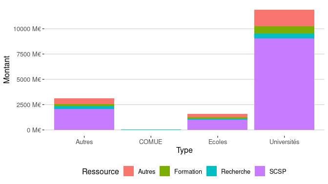<!-- -->

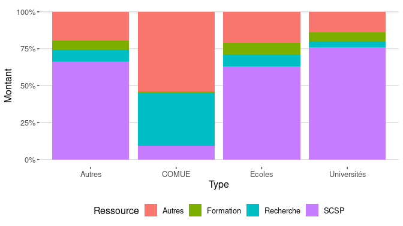<!-- -->

### Evolution macro des ressources

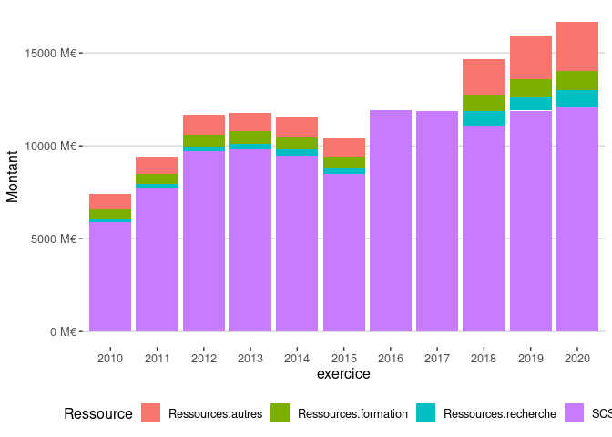<!-- -->

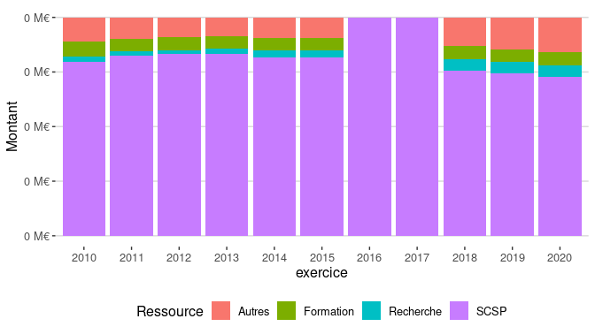<!-- -->

## Analyse des ressources formation

### Répartition par type en 2020

    ## Warning: Removed 74 rows containing missing values (position_stack).

<!-- -->

    ## Warning: Removed 74 rows containing missing values (position_stack).

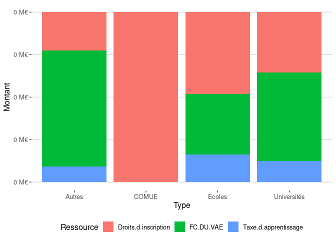<!-- -->

### Evolution

    ## Warning: Removed 1520 rows containing missing values (position_stack).

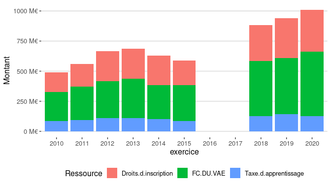<!-- -->

    ## Warning: Removed 1520 rows containing missing values (position_stack).

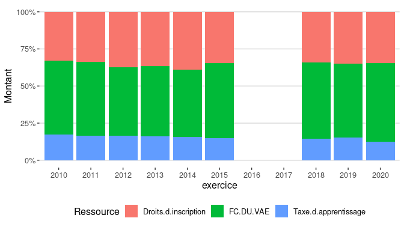<!-- -->

## Analyse des ressources recherche

### Répartition par type en 2020

    ## Warning: Removed 144 rows containing missing values (position_stack).

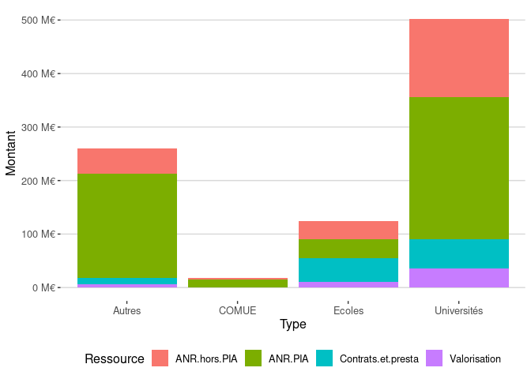<!-- -->

    ## Warning: Removed 144 rows containing missing values (position_stack).

<!-- -->

### Evolution

    ## Warning: Removed 1993 rows containing missing values (position_stack).

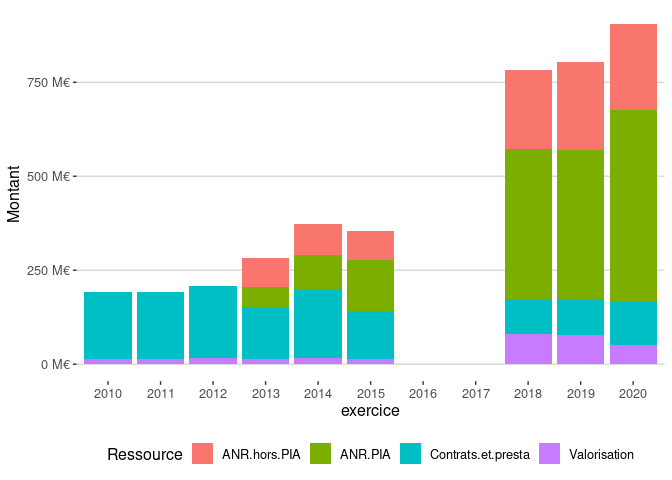<!-- -->

    ## Warning: Removed 1993 rows containing missing values (position_stack).

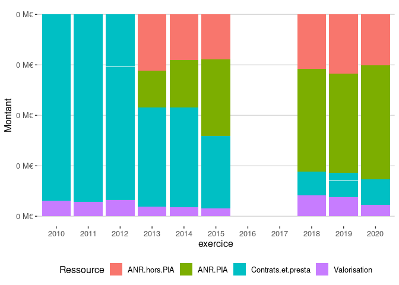<!-- -->

## Analyse des autres ressources propres

### Répartition par type en 2020

    ## Warning: Removed 62 rows containing missing values (position_stack).

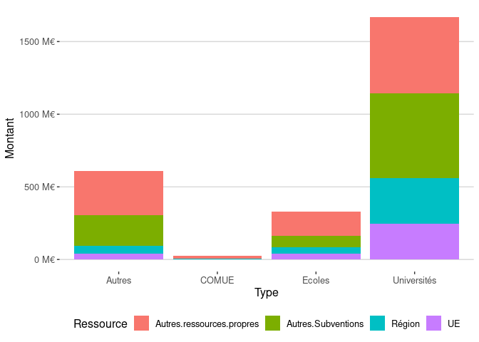<!-- -->

    ## Warning: Removed 62 rows containing missing values (position_stack).

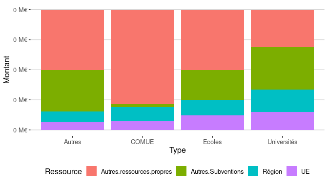<!-- -->

### Evolution

    ## Warning: Removed 1809 rows containing missing values (position_stack).

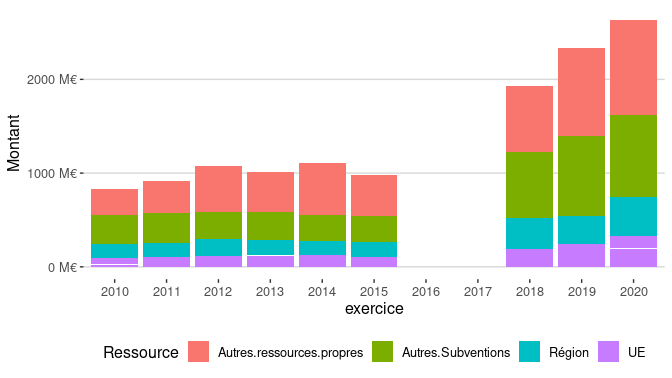<!-- -->

    ## Warning: Removed 1809 rows containing missing values (position_stack).

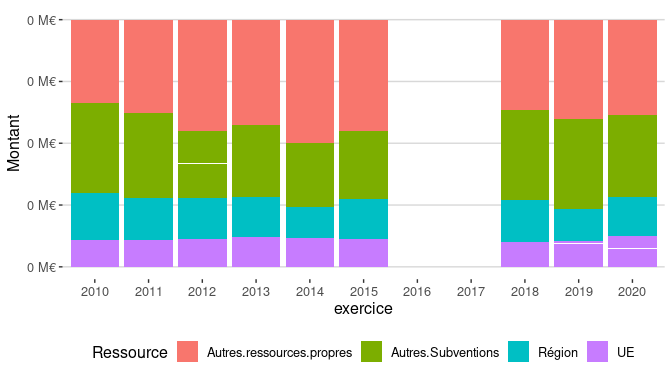<!-- -->

## Analyse SCSP

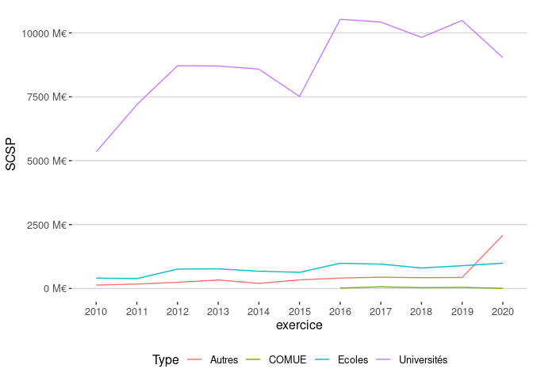<!-- -->

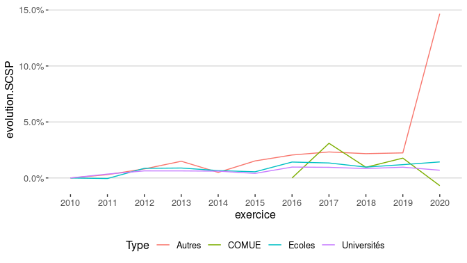<!-- -->

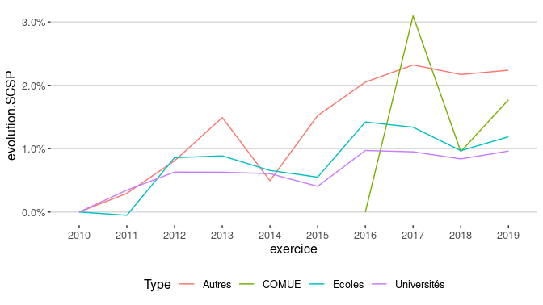<!-- -->
