Etude des évolutions par étudiant
================

Ce travail exploratoire des données ne saurait être considéré comme
abouti. Il présente sommairement plusieurs indicateurs, avec peut de
considération pour la présentation, pour ensuite servir de base à un
travail plus peaufiné.

*Attention :* les ressources par étudiant, appelées officiellement
“dépense par étudiant”, ne sont pas le coût des études, mais les
ressources dont les établissements disposent divisiées par le nombre
d’étudiants de cet établissement.

La différence entre les deux peut être substantielle, notamment pour les
universités dont les missions dépassent très largement la seule
formation.

L’appelation officielle “dépende par étudiant” doit donc être comprise
comme “dépense pour financer les établissements de l’ESR divisée par le
nombre d’étudiant”.

Plus d’information dans [“Combien coûte une formation universitaire (et
par extension celle des étudiants étrangers)
?”](https://blog.educpros.fr/julien-gossa/2019/01/18/combien-coute-une-formation-universitaire-et-par-extension-celle-des-etudiants-etrangers/).

## Tendances globales

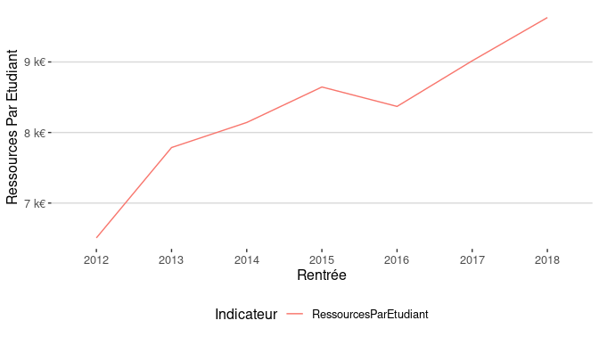<!-- -->

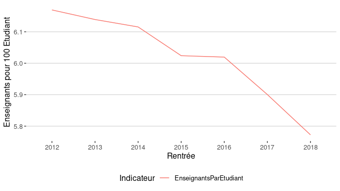<!-- -->

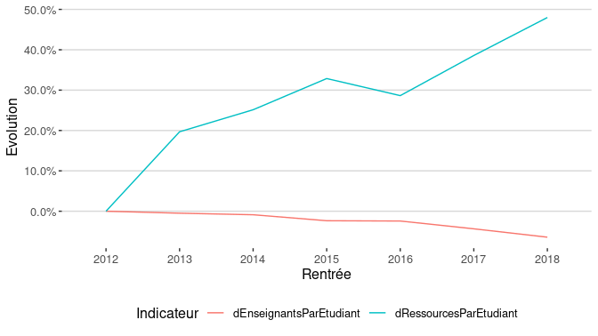<!-- -->

## Par type de ressources

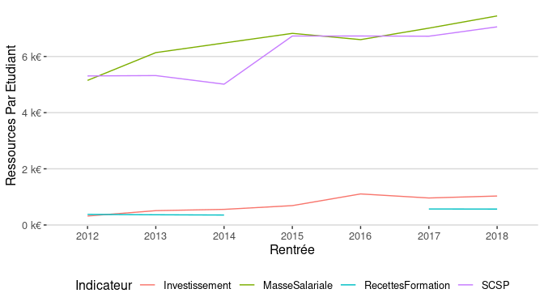<!-- -->

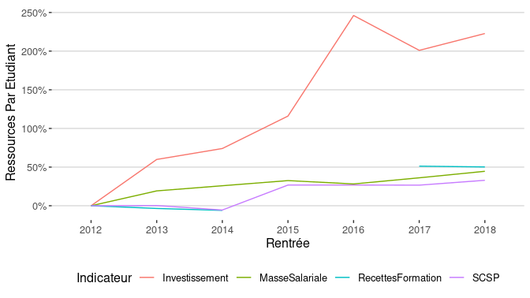<!-- -->

## Par type d’établissement

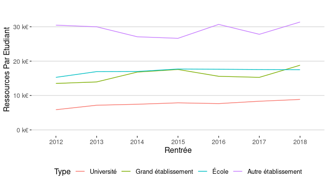<!-- -->

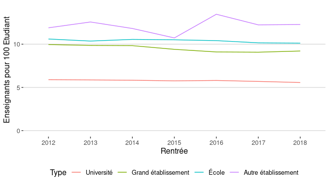<!-- -->

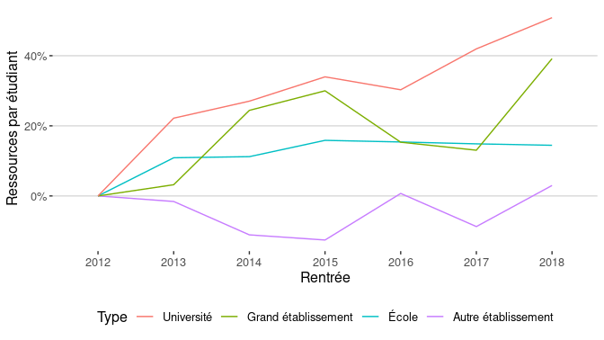<!-- -->

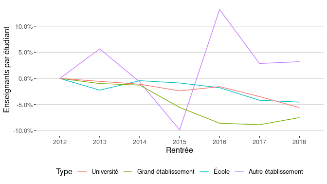<!-- -->

## Par type d’établissement et de ressources

    ## Warning: Removed 3 row(s) containing missing values (geom_path).

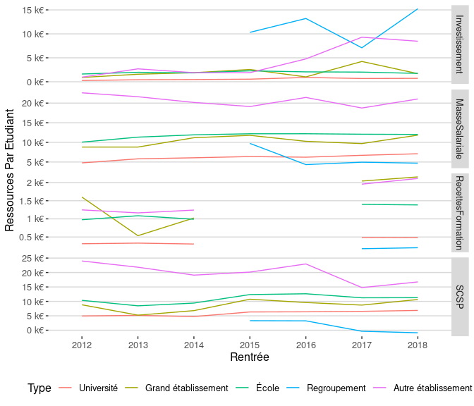<!-- -->

    ## Warning: Removed 28 row(s) containing missing values (geom_path).

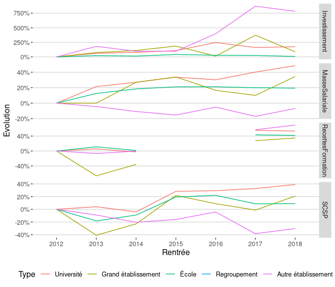<!-- -->
