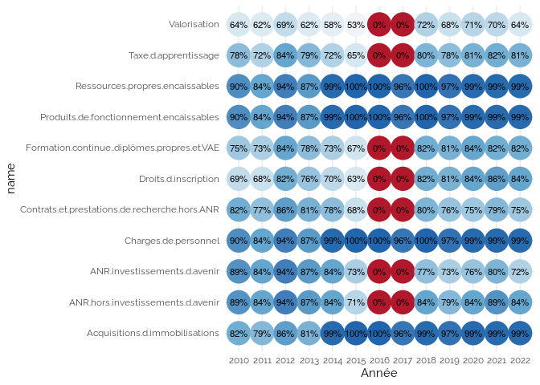
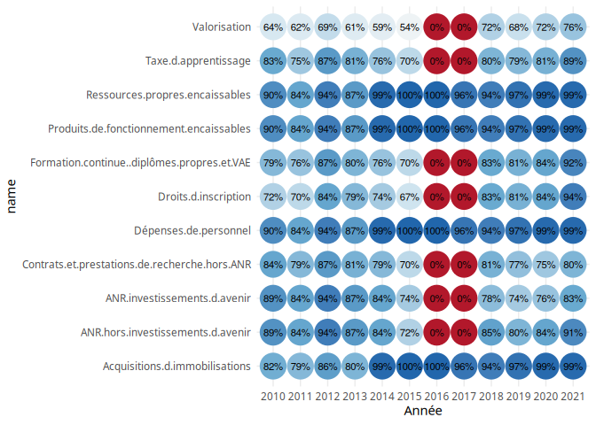

MAJ Appariements
================
2023-10-31

## Chargement des données

<table>
<thead>
<tr>
<th style="text-align:left;">
dataset
</th>
<th style="text-align:right;">
nb_etabs
</th>
</tr>
</thead>
<tbody>
<tr>
<td style="text-align:left;">
etab.19
</td>
<td style="text-align:right;">
75
</td>
</tr>
<tr>
<td style="text-align:left;">
etab.20
</td>
<td style="text-align:right;">
14
</td>
</tr>
<tr>
<td style="text-align:left;">
etab.21.2
</td>
<td style="text-align:right;">
7
</td>
</tr>
<tr>
<td style="text-align:left;">
etab.22
</td>
<td style="text-align:right;">
10
</td>
</tr>
<tr>
<td style="text-align:left;">
etab.23
</td>
<td style="text-align:right;">
248
</td>
</tr>
</tbody>
</table>

## Chargement des données data

    ## Joining with `by = join_by(pid, UAI)`
    ## Joining with `by = join_by(pid, UAI)`
    ## Joining with `by = join_by(pid, UAI)`
    ## Joining with `by = join_by(pid, UAI)`
    ## Joining with `by = join_by(pid)`

    ## Warning in full_join(., imo %>% rename(imo = etab)): Detected an unexpected many-to-many relationship between `x` and `y`.
    ## ℹ Row 2 of `x` matches multiple rows in `y`.
    ## ℹ Row 104 of `y` matches multiple rows in `x`.
    ## ℹ If a many-to-many relationship is expected, set `relationship =
    ##   "many-to-many"` to silence this warning.

    ## `summarise()` has grouped output by 'pid'. You can override using the `.groups`
    ## argument.

### Détection des pids manquants

Voir les données

| pid | UAI      | enstit | ensnp | bia | etu                               | fin | imo |
|:----|:---------|:-------|:------|:----|:----------------------------------|:----|:----|
|     | 0352756F | NA     | NA    | NA  | Université européenne de Bretagne | NA  | NA  |
|     | 0352756F | NA     | NA    | NA  | Université Bretagne Loire         | NA  | NA  |

### Détection des doubles pid

Voir les données

| pid               | UAI      | enstit | ensnp | bia | etu                                                          | fin | imo                                                                                                                                                                                   |
|:------------------|:---------|:-------|:------|:----|:-------------------------------------------------------------|:----|:--------------------------------------------------------------------------------------------------------------------------------------------------------------------------------------|
| z3hdL;hy4EW       | 9710585J |        |       | NA  | Université des Antilles et de la Guyane                      | NA  | NA                                                                                                                                                                                    |
| Z2FY5;zepT6       | 9830491S | NA     | NA    | NA  | Institut universitaire de formation des maîtres du Pacifique | NA  | NA                                                                                                                                                                                    |
| jYUcF,IXHyv       | NA       | NA     | NA    | NA  | NA                                                           | NA  | ENSAM - École nationale supérieure d’arts et métiers,Université d’Angers                                                                                                              |
| G4572,TeXD3,u79ZJ | NA       | NA     | NA    | NA  | NA                                                           | NA  | Université de Rouen Normandie,INSA-Rouen - Institut national des sciences appliquées de Rouen,IEP-Paris - Institut d’études politiques de Paris,PARTIES COMMUNES PARTENAIRE GÉNÉRIQUE |
| I4SPK,p25Q3       | NA       | NA     | NA    | NA  | NA                                                           | NA  | École nationale supérieure d’ingénieurs de Caen,Université de Caen Normandie                                                                                                          |
| m7K6T,mMex4       | NA       | NA     | NA    | NA  | NA                                                           | NA  | Toulouse-III “Université Paul Sabatier”,INPT - Institut national polytechnique Toulouse,PARTIES COMMUNES PARTENAIRE GÉNÉRIQUE                                                         |

### Détection des doubles UAI

Voir les données

| pid   | UAI               | enstit                                                        | ensnp                                                         | bia                                                           | etu | fin | imo                                                                                                                                   |
|:------|:------------------|:--------------------------------------------------------------|:--------------------------------------------------------------|:--------------------------------------------------------------|:----|:----|:--------------------------------------------------------------------------------------------------------------------------------------|
| 54VTe | 0597139P;0590349J | Centrale Lille Institut                                       | Centrale Lille Institut                                       | Centrale Lille Institut                                       | NA  | NA  | Centrale Lille Institut                                                                                                               |
| 6kk6n | 0912423P;0940607Z | École normale supérieure Paris-Saclay                         | École normale supérieure Paris-Saclay                         | École normale supérieure Paris-Saclay                         | NA  | NA  | ENS Paris-Saclay                                                                                                                      |
| 3Z5e6 | 0772502B;0932056E | Université Gustave Eiffel                                     | Université Gustave Eiffel                                     | Université Gustave Eiffel                                     | NA  | NA  | UGE - Université Gustave Eiffel                                                                                                       |
| 3Z5e6 | 0772502B;0932056E | Université Gustave Eiffel                                     | Université Gustave Eiffel                                     | Université Gustave Eiffel                                     | NA  | NA  | UGE - Université Gustave Eiffel,Centre d’études et d’expertise sur les risques,l’environnement,la mobilité et l’aménagement (CEREMA)  |
| QYw7j | 0180974L;0411068N | Institut national des sciences appliquées Centre Val de Loire | Institut national des sciences appliquées Centre Val de Loire | Institut national des sciences appliquées Centre Val de Loire | NA  | NA  | INERIS - INST NAT DE L’ENVIRONNEMENT INDUS ET DES RISQUES,INSA-CVL - Institut national des sciences appliquées du Centre Val de Loire |
| QYw7j | 0180974L;0411068N | Institut national des sciences appliquées Centre Val de Loire | Institut national des sciences appliquées Centre Val de Loire | Institut national des sciences appliquées Centre Val de Loire | NA  | NA  | INSA-CVL - Institut national des sciences appliquées du Centre Val de Loire                                                           |

### Détection des UAI vers plusieurs pid

Voir les données

| pid         | UAI      | dataset | enstit                     | ensnp                      | bia                        | etu                                                                                                                                                 | fin                        |
|:------------|:---------|:--------|:---------------------------|:---------------------------|:---------------------------|:----------------------------------------------------------------------------------------------------------------------------------------------------|:---------------------------|
| a5ZAn       | 0301687W | fin     | NA                         | NA                         | NA                         | NA                                                                                                                                                  | CUFR de Nîmes              |
| HAU8L       | 0301687W | fin     | Université de Nîmes        | Université de Nîmes        | Université de Nîmes        | Université de Nîmes;Centre universitaire de formation et de recherche de Nîmes                                                                      | UNÎMES                     |
| z3hdL       | 9710585J | enstit  | Université des Antilles;NA | Université des Antilles;NA | Université des Antilles;NA | Université des Antilles;Institut universitaire de formation des maîtres de Martinique;Institut universitaire de formation des maîtres de Guadeloupe | Université des Antilles;NA |
| z3hdL;hy4EW | 9710585J | enstit  |                            |                            | NA                         | Université des Antilles et de la Guyane                                                                                                             | NA                         |
| z3hdL       | 9710585J | ensnp   | Université des Antilles;NA | Université des Antilles;NA | Université des Antilles;NA | Université des Antilles;Institut universitaire de formation des maîtres de Martinique;Institut universitaire de formation des maîtres de Guadeloupe | Université des Antilles;NA |
| z3hdL;hy4EW | 9710585J | ensnp   |                            |                            | NA                         | Université des Antilles et de la Guyane                                                                                                             | NA                         |

## Fix fin

### AutoFix fin

Voir les données

| UAI      | pid   | pid.fin | etab                                       |
|:---------|:------|:--------|:-------------------------------------------|
| 0751722P | bxPQe | 3RMeh   | Université PARIS 6 - PIERRE ET MARIE CURIE |
| 0631262E | K4lR3 | 3itX6   | Université CLERMONT-FERRAND 1 - AUVERGNE   |
| 0751723R | 5cZyU | 5KpJ9   | Université PARIS 7 - DENIS DIDEROT         |
| 0590311T | 54VTe | 67su6   | ENS CHIMIE LILLE                           |
| 0060931E | s3t8T | 7CYWd   | Université NICE - SOPHIA-ANTIPOLIS         |
| 0440984F | qUCQp | 7hB8r   | Université NANTES                          |

Check

| UAI | pid | pid.fin | etab |
|:----|:----|:--------|:-----|

### Modifications manuelles du fix

Voir les données

| UAI      | pid.dst | pid.src | etab                                       |
|:---------|:--------|:--------|:-------------------------------------------|
| 0751722P | bxPQe   | 3RMeh   | Université PARIS 6 - PIERRE ET MARIE CURIE |
| 0631262E | K4lR3   | 3itX6   | Université CLERMONT-FERRAND 1 - AUVERGNE   |
| 0751723R | 5cZyU   | 5KpJ9   | Université PARIS 7 - DENIS DIDEROT         |
| 0590311T | 54VTe   | 67su6   | ENS CHIMIE LILLE                           |
| 0060931E | s3t8T   | 7CYWd   | Université NICE - SOPHIA-ANTIPOLIS         |
| 0440984F | qUCQp   | 7hB8r   | Université NANTES                          |

## Fix imo

### Autofix imo

    ## Joining with `by = join_by(pid)`

Check sans correspondance

| pid   | etab.imo                                                                                                                                             | pid.imo     | UAI      | etab                                   | n_match |
|:------|:-----------------------------------------------------------------------------------------------------------------------------------------------------|:------------|:---------|:---------------------------------------|--------:|
| 2ALYK | IPG - Institut polytechnique Grenoble,Université Grenoble Alpes                                                                                      | 2ALYK,Y7ch7 | 0381912X | Institut polytechnique de Grenoble     |       2 |
| Y7ch7 | IPG - Institut polytechnique Grenoble,Université Grenoble Alpes                                                                                      | 2ALYK,Y7ch7 | 0381838S | Université Grenoble Alpes              |       2 |
| 6G2TU | Paris-I “Université Panthéon-Sorbonne”,Paris-II “Université Panthéon-Assas”                                                                          | 6G2TU,TWBzp | 0751717J | Université Paris 1 - Panthéon Sorbonne |       2 |
| TWBzp | Paris-I “Université Panthéon-Sorbonne”,Paris-II “Université Panthéon-Assas”                                                                          | 6G2TU,TWBzp | 0751718K | Université Paris-Panthéon-Assas        |       2 |
| 5cZyU | ENS - École Normale Supérieure,CROUS de l’académie de Paris (CROUS de Paris),Centre national de la recherche scientifique (CNRS),Université de Paris | 8618D,5cZyU | 0751723R | Université Paris Cité                  |       2 |
| 8618D | ENS - École Normale Supérieure,CROUS de l’académie de Paris (CROUS de Paris),Centre national de la recherche scientifique (CNRS),Université de Paris | 8618D,5cZyU | 0753455Y | École normale supérieure PSL           |       2 |

Les bâtiments entre plusieurs établissements sont exclus du jeu de
données.

Nombre d’exclusion

| Année | n_batiments | n_exclus | part  |
|------:|------------:|---------:|:------|
|  2017 |        6339 |       17 | 0.27% |
|  2018 |        6357 |       20 | 0.31% |
|  2019 |        6380 |       21 | 0.33% |
|  2020 |        6350 |       25 | 0.39% |
|  2021 |        6406 |       25 | 0.39% |
|  2022 |        6407 |       27 | 0.42% |

## Application du fix

### Check : données incomplètes Universités

<table>
<thead>
<tr>
<th style="text-align:left;">
pid
</th>
<th style="text-align:left;">
etab
</th>
<th style="text-align:left;">
datasets
</th>
</tr>
</thead>
<tbody>
<tr>
<td style="text-align:left;">
</td>
<td style="text-align:left;">
Université Bretagne Loire;Université Bretagne Loire;Université
européenne de Bretagne
</td>
<td style="text-align:left;">
etu fin etu
</td>
</tr>
<tr>
<td style="text-align:left;">
4a8B2
</td>
<td style="text-align:left;">
Université fédérale de Toulouse Midi-Pyrénées;Université fédérale de
Toulouse Midi-Pyrénées
</td>
<td style="text-align:left;">
bia fin
</td>
</tr>
<tr>
<td style="text-align:left;">
52U59
</td>
<td style="text-align:left;">
Université confédérale Léonard de Vinci;Université confédérale Léonard
de Vinci
</td>
<td style="text-align:left;">
bia fin
</td>
</tr>
<tr>
<td style="text-align:left;">
6g0Mb
</td>
<td style="text-align:left;">
Université PARIS-EST
</td>
<td style="text-align:left;">
fin
</td>
</tr>
<tr>
<td style="text-align:left;">
86UpY
</td>
<td style="text-align:left;">
Université Paris Lumières;Université Paris Lumières;Université Paris
Lumières
</td>
<td style="text-align:left;">
bia etu fin
</td>
</tr>
<tr>
<td style="text-align:left;">
8A0mg
</td>
<td style="text-align:left;">
Université BOURGOGNE FRANCHE-COMTÉ;Université Bourgogne -
Franche-Comté;Université Bourgogne - Franche-Comté
</td>
<td style="text-align:left;">
fin bia etu
</td>
</tr>
<tr>
<td style="text-align:left;">
EPci7
</td>
<td style="text-align:left;">
HESAM Université
</td>
<td style="text-align:left;">
bia
</td>
</tr>
<tr>
<td style="text-align:left;">
G1r6y
</td>
<td style="text-align:left;">
Normandie Université
</td>
<td style="text-align:left;">
bia
</td>
</tr>
<tr>
<td style="text-align:left;">
PpsCQ
</td>
<td style="text-align:left;">
Université Paris sciences et lettres;Université Paris sciences et
lettres;Université Paris sciences et lettres;Université Paris sciences
et lettres;Université Paris sciences et lettres;Université de Paris
sciences et lettres;Université de recherche Paris sciences et lettres -
PSL Research University;Université de recherche
Paris-Sciences-et-Lettres
</td>
<td style="text-align:left;">
enstit ensnp bia bia etu fin fin etu
</td>
</tr>
<tr>
<td style="text-align:left;">
iq0rG
</td>
<td style="text-align:left;">
Université de Lyon;Université de Lyon
</td>
<td style="text-align:left;">
bia fin
</td>
</tr>
<tr>
<td style="text-align:left;">
tIJ02
</td>
<td style="text-align:left;">
Université Jean Monnet;Université Jean Monnet;Université Jean
Monnet;Université Jean Monnet;Université SAINT-ETIENNE - JEAN MONNET
</td>
<td style="text-align:left;">
enstit ensnp bia etu fin
</td>
</tr>
<tr>
<td style="text-align:left;">
u79ZJ
</td>
<td style="text-align:left;">
IEP-Paris - Institut d’études politiques de Paris,Paris-II "Université
Panthéon-Assas"
</td>
<td style="text-align:left;">
imo
</td>
</tr>
<tr>
<td style="text-align:left;">
uCPtX
</td>
<td style="text-align:left;">
Université Sorbonne Paris Cité (USPC)
</td>
<td style="text-align:left;">
fin
</td>
</tr>
</tbody>
</table>

## Chargement des données CPESR

<table>
<thead>
<tr>
<th style="text-align:right;">
nb_etabs
</th>
</tr>
</thead>
<tbody>
<tr>
<td style="text-align:right;">
294
</td>
</tr>
</tbody>
</table>

### Détection des établissements en double

<table>
<thead>
<tr>
<th style="text-align:left;">
UAI
</th>
<th style="text-align:left;">
Etablissement
</th>
<th style="text-align:left;">
Type
</th>
<th style="text-align:left;">
Groupe
</th>
<th style="text-align:left;">
PerimEx
</th>
<th style="text-align:left;">
Association
</th>
<th style="text-align:left;">
Comparable
</th>
</tr>
</thead>
<tbody>
<tr>
</tr>
</tbody>
</table>

## Ajout des pid à cpesr

    ## Joining with `by = join_by(UAI)`

### Détection double pid

Voir les données

| pid | UAI | Etablissement | Type | Groupe | PerimEx | Association | Comparable |
|:----|:----|:--------------|:-----|:-------|:--------|:------------|:-----------|

### université cpesr sans pid

Voir les données

| pid | UAI | Etablissement | Type | Groupe | PerimEx | Association | Comparable |
|:----|:----|:--------------|:-----|:-------|:--------|:------------|:-----------|

### pid hors cpesr

    ## Joining with `by = join_by(UAI)`

Voir les données

| pid                           | UAI      | etab                                                                                                                                                                                                                                               |
|:------------------------------|:---------|:---------------------------------------------------------------------------------------------------------------------------------------------------------------------------------------------------------------------------------------------------|
| 2ALYK,Y7ch7                   | NA       | IPG - Institut polytechnique Grenoble,Université Grenoble Alpes                                                                                                                                                                                    |
| 6G2TU,TWBzp                   | NA       | Paris-I “Université Panthéon-Sorbonne”,Paris-II “Université Panthéon-Assas”                                                                                                                                                                        |
| 8618D,5cZyU                   | NA       | ENS - École Normale Supérieure,CROUS de l’académie de Paris (CROUS de Paris),Centre national de la recherche scientifique (CNRS),Université de Paris                                                                                               |
| 8DrrS                         | 0755449R | Musée du Quai Branly                                                                                                                                                                                                                               |
| 8k883,bxPQe,6G2TU,5cZyU,QXnpG | NA       | Paris-III “Université La Sorbonne Nouvelle”,Sorbonne Université,Paris-I “Université Panthéon-Sorbonne”,EDUCATION NATIONALE SERVICES DÉCONCENTRÉS,Université de Paris,Chancellerie des Universités de Paris,EPHE - École pratique des hautes études |
| 8k883,bxPQe,6G2TU,O2v0H,QXnpG | NA       | Paris-III “Université La Sorbonne Nouvelle”,Sorbonne Université,Paris-I “Université Panthéon-Sorbonne”,EDUCATION NATIONALE SERVICES DÉCONCENTRÉS,Université de Paris,Chancellerie des Universités de Paris,EPHE - École pratique des hautes études |

### pid hors cpesr dans etab

Voir les données

    ## Joining with `by = join_by(UAI)`

| pid                           | UAI | etab                                                                                                                                                                                                                                               | Etablissement                                | Sigle       | Type  | Typologie | Secteur | Académie | Rattachement | Fusion | url.siteweb            | url.wikidata                               | url.legifrance | twitter | dataset |
|:------------------------------|:----|:---------------------------------------------------------------------------------------------------------------------------------------------------------------------------------------------------------------------------------------------------|:---------------------------------------------|:------------|:------|:----------|:--------|:---------|:-------------|:-------|:-----------------------|:-------------------------------------------|:---------------|:--------|:--------|
| 2ALYK,Y7ch7                   | NA  | IPG - Institut polytechnique Grenoble,Université Grenoble Alpes                                                                                                                                                                                    | Groupe Institut catholique d’arts et métiers | Groupe ICAM | École | NA        | Privé   | Paris    | NA           | NA     | <https://www.icam.fr/> | <https://www.wikidata.org/entity/Q3151859> | NA             | NA      | etab.23 |
| 6G2TU,TWBzp                   | NA  | Paris-I “Université Panthéon-Sorbonne”,Paris-II “Université Panthéon-Assas”                                                                                                                                                                        | Groupe Institut catholique d’arts et métiers | Groupe ICAM | École | NA        | Privé   | Paris    | NA           | NA     | <https://www.icam.fr/> | <https://www.wikidata.org/entity/Q3151859> | NA             | NA      | etab.23 |
| 8618D,5cZyU                   | NA  | ENS - École Normale Supérieure,CROUS de l’académie de Paris (CROUS de Paris),Centre national de la recherche scientifique (CNRS),Université de Paris                                                                                               | Groupe Institut catholique d’arts et métiers | Groupe ICAM | École | NA        | Privé   | Paris    | NA           | NA     | <https://www.icam.fr/> | <https://www.wikidata.org/entity/Q3151859> | NA             | NA      | etab.23 |
| 8k883,bxPQe,6G2TU,5cZyU,QXnpG | NA  | Paris-III “Université La Sorbonne Nouvelle”,Sorbonne Université,Paris-I “Université Panthéon-Sorbonne”,EDUCATION NATIONALE SERVICES DÉCONCENTRÉS,Université de Paris,Chancellerie des Universités de Paris,EPHE - École pratique des hautes études | Groupe Institut catholique d’arts et métiers | Groupe ICAM | École | NA        | Privé   | Paris    | NA           | NA     | <https://www.icam.fr/> | <https://www.wikidata.org/entity/Q3151859> | NA             | NA      | etab.23 |
| 8k883,bxPQe,6G2TU,O2v0H,QXnpG | NA  | Paris-III “Université La Sorbonne Nouvelle”,Sorbonne Université,Paris-I “Université Panthéon-Sorbonne”,EDUCATION NATIONALE SERVICES DÉCONCENTRÉS,Université de Paris,Chancellerie des Universités de Paris,EPHE - École pratique des hautes études | Groupe Institut catholique d’arts et métiers | Groupe ICAM | École | NA        | Privé   | Paris    | NA           | NA     | <https://www.icam.fr/> | <https://www.wikidata.org/entity/Q3151859> | NA             | NA      | etab.23 |
| CUBKB,7Gzub                   | NA  | Lyon-II “Université Lumière”,Lyon-III “Université Jean Moulin”                                                                                                                                                                                     | Groupe Institut catholique d’arts et métiers | Groupe ICAM | École | NA        | Privé   | Paris    | NA           | NA     | <https://www.icam.fr/> | <https://www.wikidata.org/entity/Q3151859> | NA             | NA      | etab.23 |

### pid hors cpesr hors etab

Voir les données

    ## Joining with `by = join_by(UAI)`

| pid   | UAI      | etab                         | Etablissement | Sigle | Type | Typologie | Secteur | Académie | Rattachement | Fusion | url.siteweb | url.wikidata | url.legifrance | twitter | dataset |
|:------|:---------|:-----------------------------|:--------------|:------|:-----|:----------|:--------|:---------|:-------------|:-------|:------------|:-------------|:---------------|:--------|:--------|
| 8DrrS | 0755449R | Musée du Quai Branly         | NA            | NA    | NA   | NA        | NA      | NA       | NA           | NA     | NA          | NA           | NA             | NA      | NA      |
| ClZg2 | 0492498Z | COMUE Angers-Le Mans         | NA            | NA    | NA   | NA        | NA      | NA       | NA           | NA     | NA          | NA           | NA             | NA      | NA      |
| wc3zx | 0311514C | Toulouse School of Economics | NA            | NA    | NA   | NA        | NA      | NA       | NA           | NA     | NA          | NA           | NA             | NA      | NA      |

## Créations du jeu de données établissement

    ## Joining with `by = join_by(UAI)`
    ## Joining with `by = join_by(pid)`

Voir les données

    ## `summarise()` has grouped output by 'Groupe'. You can override using the
    ## `.groups` argument.

| Groupe                   | nb_ds_3 | nb_ds_4 | nb_ds_5 | nb_ds_6 | nb_ds_1 | nb_ds_2 |
|:-------------------------|--------:|--------:|--------:|--------:|--------:|--------:|
| Universités et assimilés |       1 |       1 |       2 |      66 |       0 |       0 |
| Regroupements            |       4 |       0 |       0 |       0 |       1 |       5 |
| Ecoles d’ingénieurs      |       0 |       0 |       1 |      30 |       1 |       0 |
| Autres établissements    |       4 |       2 |       5 |      25 |       1 |       4 |

### Vérification doublons

Voir les données

| pid | Etablissement | Groupe | Groupe.détaillé | Type | nb_datasets | UAI | PerimEx | Association | Comparable | Sigle | Typologie | Secteur | Académie | Rattachement | Fusion | url.siteweb | url.wikidata | url.legifrance | twitter | dataset | Plotable |
|:----|:--------------|:-------|:----------------|:-----|------------:|:----|:--------|:------------|:-----------|:------|:----------|:--------|:---------|:-------------|:-------|:------------|:-------------|:---------------|:--------|:--------|:---------|

Voir les données

| pid | Etablissement | Groupe | Groupe.détaillé | Type | nb_datasets | UAI | PerimEx | Association | Comparable | Sigle | Typologie | Secteur | Académie | Rattachement | Fusion | url.siteweb | url.wikidata | url.legifrance | twitter | dataset | Plotable |
|:----|:--------------|:-------|:----------------|:-----|------------:|:----|:--------|:------------|:-----------|:------|:----------|:--------|:---------|:-------------|:-------|:------------|:-------------|:---------------|:--------|:--------|:---------|

### Wikidata manquants

Voir les données

| Groupe                | pid   | Etablissement                                            | url.wikidata |
|:----------------------|:------|:---------------------------------------------------------|:-------------|
| Autres établissements | vQ6Hh | Académie des sciences d’outre-mer                        | NA           |
| Autres établissements | J8X6q | Agence bibliographique de l’enseignement supérieur       | NA           |
| Autres établissements | VfvdY | Bibliothèque nationale et universitaire de Strasbourg    | NA           |
| Autres établissements | 1bXaK | Bibliothèque universitaire des langues et civilisations  | NA           |
| Autres établissements | QuDx7 | Centre informatique national de l’enseignement supérieur | NA           |
| Autres établissements | fV2g5 | Centre technique du livre de l’enseignement supérieur    | NA           |

#### Correction manuelle

Voir les données

| pid   | url.wikidata                              |
|:------|:------------------------------------------|
| VfvdY | <https://www.wikidata.org/entity/Q630461> |

### Sigles manquants

#### Sigles récupérables sur wikidata

    ## Warning: There were 9 warnings in `mutate()`.
    ## The first warning was:
    ## ℹ In argument: `wikidata.alias = `$`(...)`.
    ## Caused by warning in `wdesr_get_item_status()`:
    ## ! The instance of wikidata item Q74452784 is not recommended: université.
    ##   Reason is: Statut trop imprécis.
    ##   Please check https://www.wikidata.org/wiki/Q74452784
    ##   using the guideline at https://github.com/cpesr
    ## ℹ Run `dplyr::last_dplyr_warnings()` to see the 8 remaining warnings.

Voir les données

| pid   | Etablissement                          | Sigle     |
|:------|:---------------------------------------|:----------|
| 4k25D | Université de Strasbourg               | Unistra   |
| 7Gzub | Université Jean Moulin - Lyon 3        | Lyon 3    |
| 8k883 | Université Sorbonne Nouvelle - Paris 3 | Paris 3   |
| 91D9w | Université de Rennes 1                 | UR1       |
| BWbvP | Université d’Artois                    | U. Artois |
| C701f | Université de Toulon                   | Ustv      |

#### Sigles toujours manquants et fix automatique

Voir les données

| UAI      | pid   | Etablissement                                            | Sigle | url.wikidata |
|:---------|:------|:---------------------------------------------------------|:------|:-------------|
| 0755040W | 1bXaK | Bibliothèque universitaire des langues et civilisations  | NA    | NA           |
| 0341920C | J8X6q | Agence bibliographique de l’enseignement supérieur       | NA    | NA           |
| 0342032Z | QuDx7 | Centre informatique national de l’enseignement supérieur | NA    | NA           |
| 0772428W | fV2g5 | Centre technique du livre de l’enseignement supérieur    | NA    | NA           |
| 0752744A | vQ6Hh | Académie des sciences d’outre-mer                        | NA    | NA           |
| 0597239Y | U8a0v | Université de Lille                                      | NA    | NA           |

### Ecriture des fichiers

Voir les données

| pid   | Etablissement                   | Groupe                   | Groupe.détaillé          | Type                | nb_datasets | UAI      | PerimEx | Association | Comparable | Sigle                  | Typologie                                | Secteur | Académie      | Rattachement | Fusion | url.siteweb                       | url.wikidata                                | url.legifrance                                                 | twitter                               | dataset | Plotable |
|:------|:--------------------------------|:-------------------------|:-------------------------|:--------------------|------------:|:---------|:--------|:------------|:-----------|:-----------------------|:-----------------------------------------|:--------|:--------------|:-------------|:-------|:----------------------------------|:--------------------------------------------|:---------------------------------------------------------------|:--------------------------------------|:--------|:---------|
| xJdyB | Aix-Marseille Université        | Universités et assimilés | Universités et assimilés | Université          |           6 | 0134009M | IDEx    | Udice       | TRUE       | AMU                    | Université pluridisciplinaire avec santé | Public  | Aix-Marseille | NA           | TRUE   | <https://www.univ-amu.fr/>        | <https://www.wikidata.org/entity/Q2302586>  | <https://www.legifrance.gouv.fr/jorf/id/JORFTEXT000046004125/> | <https://twitter.com/univamu>         | etab.23 | TRUE     |
| vxHYt | Avignon Université              | Universités et assimilés | Universités et assimilés | Université          |           6 | 0840685N |         | AUREF       | TRUE       | AU                     | Université pluridisciplinaire hors santé | Public  | Aix-Marseille | NA           | NA     | <https://univ-avignon.fr/>        | <https://www.wikidata.org/entity/Q2033119>  | <https://www.legifrance.gouv.fr/jorf/id/JORFTEXT000032101280/> | <https://twitter.com/univavignon>     | etab.23 | TRUE     |
| RS4WF | CY Cergy Paris Université       | Universités et assimilés | Universités et assimilés | Université          |           6 | 0952259P | ISITE   |             | FALSE      | CY                     | Université pluridisciplinaire hors santé | Public  | Versailles    | NA           | NA     | <https://www.cyu.fr/>             | <https://www.wikidata.org/entity/Q74452784> | <https://www.legifrance.gouv.fr/jorf/id/JORFTEXT000042393673/> | <https://twitter.com/UniversiteCergy> | etab.23 | TRUE     |
| pVJpw | Centre universitaire de Mayotte | Universités et assimilés | Universités et assimilés | Autre établissement |           6 | 9760358K |         |             | FALSE      | CU de Mayotte          | Université pluridisciplinaire hors santé | Public  | Mayotte       | NA           | NA     | <http://www.univ-mayotte.fr/>     | <https://www.wikidata.org/entity/Q2946102>  | <https://www.legifrance.gouv.fr/jorf/id/JORFTEXT000042896857/> | NA                                    | etab.23 | TRUE     |
| atbEK | La Rochelle Université          | Universités et assimilés | Universités et assimilés | Université          |           6 | 0171463Y |         | AUREF       | TRUE       | La Rochelle Université | Université pluridisciplinaire hors santé | Public  | Poitiers      | NA           | NA     | <https://www.univ-larochelle.fr/> | <https://www.wikidata.org/entity/Q1500822>  | <https://www.legifrance.gouv.fr/jorf/id/JORFTEXT000041885628/> | <https://twitter.com/UnivLaRochelle>  | etab.23 | TRUE     |
| 9xlel | Le Mans Université              | Universités et assimilés | Universités et assimilés | Université          |           6 | 0720916E |         | AUREF       | TRUE       | LMU                    | Université pluridisciplinaire hors santé | Public  | Nantes        | NA           | NA     | <http://www.univ-lemans.fr/>      | <https://www.wikidata.org/entity/Q834825>   | <https://www.legifrance.gouv.fr/jorf/id/JORFTEXT000042841466/> | <https://twitter.com/LeMansUniv>      | etab.23 | TRUE     |

## Autres vérifications

### Portée variables finances

    ## Warning: Using an external vector in selections was deprecated in tidyselect 1.1.0.
    ## ℹ Please use `all_of()` or `any_of()` instead.
    ##   # Was:
    ##   data %>% select(vars)
    ## 
    ##   # Now:
    ##   data %>% select(all_of(vars))
    ## 
    ## See <https://tidyselect.r-lib.org/reference/faq-external-vector.html>.
    ## This warning is displayed once every 8 hours.
    ## Call `lifecycle::last_lifecycle_warnings()` to see where this warning was
    ## generated.

    ## `summarise()` has grouped output by 'Année'. You can override using the
    ## `.groups` argument.

<!-- -->

### Portée variables finances 2021

    ## `summarise()` has grouped output by 'Année'. You can override using the
    ## `.groups` argument.

<!-- -->

### Incohérence BIATSS

<table>
<thead>
<tr>
<th style="text-align:right;">
Année
</th>
<th style="text-align:left;">
etablissement_id_paysage_actuel
</th>
<th style="text-align:left;">
Etablissement
</th>
<th style="text-align:left;">
Catégorie
</th>
<th style="text-align:left;">
Corps
</th>
<th style="text-align:right;">
Effectif
</th>
<th style="text-align:right;">
effectif_femmes
</th>
<th style="text-align:right;">
effectif_hommes
</th>
</tr>
</thead>
<tbody>
<tr>
</tr>
</tbody>
</table>
